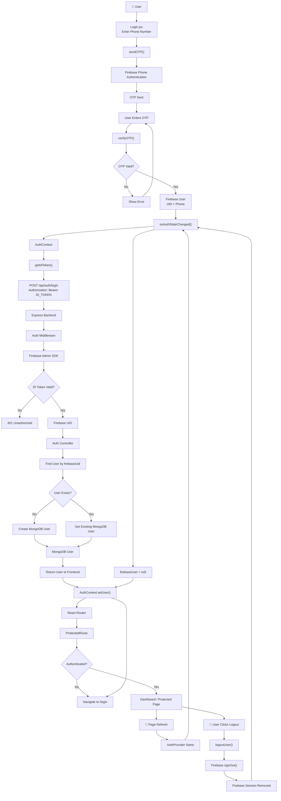

```
ER Diagram
                     ┌──────────────────────┐

                     │         USER         │

                     │──────────────────────│

                     │ user_id PK           │

                     │ firebase_uid UNIQUE  │

                     │ phone UNIQUE         │

                     │ name                 │

                     │ role                 │

                     │ is_phone_verified    │

                     │ created_at           │

                     │ updated_at           │

                     └──────────┬───────────┘

                                │

                                │ owns

                                │

                                ▼

                     ┌──────────────────────┐

                     │       PROPERTY       │

                     │──────────────────────│

                     │ property_id PK       │

                     │ owner_id FK          │

                     │ name                 │

                     │ type                 │

                     │ gender               │

                     │ description          │

                     │ status               │

                     └──────────┬───────────┘

                                │

                ┌───────────────┼────────────────┐

                │               │                │

                ▼               ▼                ▼

         ┌────────────┐  ┌────────────┐  ┌────────────┐

         │    ROOM    │  │  LOCATION  │  │   MEDIA    │

         │────────────│  │────────────│  │────────────│

         │ room_id PK │  │location_id │  │ media_id PK│

         │ property_id│  │ property_id│  │ property_id│

         │ price      │  │ address    │  │ room_id FK │

         │ sharing    │  │ area       │  │ type       │

         │ availability│ │ latitude   │  │ url        │

         └──────┬─────┘  │ longitude  │  │ is_primary │

                │         └────────────┘  └────────────┘

                │

                │ has

                ▼

         ┌────────────────┐

         │ ROOM_AMENITY   │

         │────────────────│

         │ room_id FK     │

         │ amenity_id FK  │

         └───────┬────────┘

                 │

                 ▼

         ┌────────────────┐

         │    AMENITY      │

         │────────────────│

         │ amenity_id PK   │

         │ name            │

         └────────────────┘

  ┌──────────────────────┐

  │         USER         │

  └──────────┬───────────┘

             │

             │ writes

             ▼

  ┌──────────────────────┐

  │        REVIEW        │

  │──────────────────────│

  │ review_id PK         │

  │ user_id FK           │

  │ property_id FK       │

  │ rating               │

  │ comment              │

  │ created_at           │

  └──────────┬───────────┘

             │

             ▼

          PROPERTY
```


Authentication Flow




